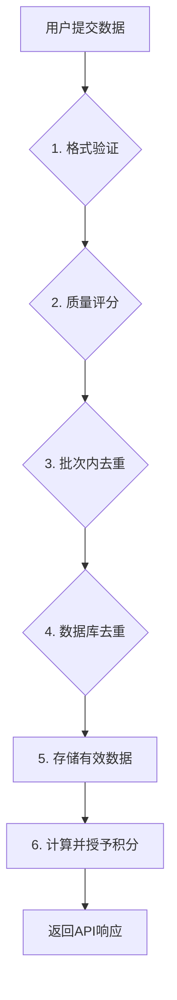

# Crawler 系统技术文档

本文档提供Crawler系统的技术概览，涵盖系统架构、核心概念、设计实现和API参考。

## 目录

- [Crawler 系统技术文档](#crawler-系统技术文档)
  - [目录](#目录)
  - [1. 系统概述](#1-系统概述)
    - [1.1. 系统目标](#11-系统目标)
    - [1.2. 核心组件](#12-核心组件)
  - [2. 核心概念](#2-核心概念)
    - [2.1. 数据源与标识符](#21-数据源与标识符)
      - [Amazon 数据](#amazon-数据)
      - [Luma 数据](#luma-数据)
    - [2.2. 数据质量分](#22-数据质量分)
    - [2.3. 积分奖励](#23-积分奖励)
  - [3. 系统设计](#3-系统设计)
    - [3.1. 数据处理流程](#31-数据处理流程)
    - [3.2. 去重策略](#32-去重策略)
    - [3.3. 数据库设计](#33-数据库设计)
  - [4. API 参考](#4-api-参考)
    - [4.1. 核心接口](#41-核心接口)
    - [4.2. 扩展接口](#42-扩展接口)
    - [4.3. 数据格式 (`DataItem`)](#43-数据格式-dataitem)
    - [4.4. 常见错误](#44-常见错误)

---

## 1. 系统概述

### 1.1. 系统目标

Crawler系统是一个用于收集、验证和管理用户提交数据（主要来自Amazon和Luma）的后端服务。系统包含数据验证、多层去重和积分奖励等功能。

### 1.2. 核心组件

- **服务层 (`crawlerService.js`)**: 核心服务，负责协调整个数据处理流程。
- **验证模块**: 确保数据格式的完整性和正确性。
- **去重引擎**: 在全局和用户两个层级防止重复数据。
- **积分服务**: 为有效的数据提交计算和发放积分。
- **数据存储**: 使用PostgreSQL数据库和Prisma ORM。

## 2. 核心概念

### 2.1. 数据源与标识符

系统处理多种数据源，每种数据源都有其唯一的标识逻辑。

#### Amazon 数据
- **主标识符**: `orderid` (例如: `113-1234567-7890123`)。
- **数据类型**: `order`。
- **关键字段**: `orderid` 是必需的。

#### Luma 数据
- **主标识符**: `eventId`、`taskId`或`id` (按此优先级)。
- **数据类型**: `event`, `task`。

### 2.2. 数据质量分

为每条提交的数据计算一个0-100的分数，以评估其质量。

| 分类 | 评分标准 | 分数 |
| :--- | :--- | :--- |
| **官方标识符** | Amazon: 有`orderid`。Luma: 有`eventId`/`taskId`/`id`。 | **40** |
| **元数据** | 有`sourceUrl` (15), 有`category` (10)。 | **25** |
| **标准字段** | Amazon: `title`+`price` (15), `currency` (10)。Luma: `title` (15), `date` (10)。 | **25** |
| **格式规范** | 有效的`timestamp`。 | **10** |

### 2.3. 积分奖励

- **计算规则**: 每提交**10条**有效数据，用户获得**100积分**。
- **上传限制**: 每日1,000条，每月10,000条。
- **无效数据**: 重复或无效数据不计分。

## 3. 系统设计

### 3.1. 数据处理流程

系统通过以下流水线处理数据：



### 3.2. 去重策略

采用三层防护机制来保证数据唯一性。

- **第1层：验证 (`validateDataItem`)**: 验证数据源、类型、`payload`和标识符格式。
- **第2层：批次内检查**: 扫描同一次提交的数据，通过`contentHash`和标题相似度进行检查。
- **第3层：数据库检查**:
  - **全局去重**: `contentHash`全局唯一，防止任何用户提交完全相同的内容。
  - **用户级去重**: `sourceId`在单个用户内唯一。不同用户可以提交相同的`sourceId`（如分享同一产品的体验），但同一用户不能重复提交。

### 3.3. 数据库设计

核心的 `CrawlerData` 表结构设计如下，以支持去重逻辑。

```prisma
model CrawlerData {
  id          String   @id @default(cuid())
  source      String   // 'amazon' or 'luma'
  type        String
  timestamp   DateTime
  payload     Json
  metadata    Json?
  contentHash String   @unique // 全局去重哈希
  sourceId    String?  // 用户级去重ID
  userId      String
  points      Int      @default(0)

  // 用户、数据源和sourceId的组合必须唯一
  @@unique([userId, source, sourceId])
  @@index([userId, source])
}
```

## 4. API 参考

> 详细的请求/响应结构请参考 `api-doc.md#crawler-api`。

### 4.1. 核心接口

| 方法 | 端点 | 描述 |
| :--- | :--- | :--- |
| `POST` | `/api/crawler/upload` | **主接口**。提交一批数据进行处理。 |
| `GET` | `/api/crawler-tasks` | 获取用户的爬虫任务列表及状态。 |
| `GET` | `/api/crawler-tasks/{taskId}` | 获取单个爬虫任务的详情。 |

### 4.2. 扩展接口

用于管理和统计的辅助接口。

| 方法 | 端点 | 描述 |
| :--- | :--- | :--- |
| `GET` | `/api/crawler/stats` | 获取用户的聚合统计数据。 |
| `GET` | `/api/crawler/limits` | 查询当前的日/月上传限制。 |
| `POST` | `/api/crawler-tasks` | 手动创建一个新的爬虫任务。 |
| `PUT` | `/api/crawler-tasks/{id}/status`| 更新任务状态。 |
| `DELETE` | `/api/crawler-tasks/{id}` | 删除一个任务及其关联数据。 |

### 4.3. 数据格式 (`DataItem`)

提交到 `/upload` 接口的每条数据的标准结构。

```typescript
interface DataItem {
  source: 'amazon' | 'luma';
  type: 'order' | 'product' | 'event' | 'task' | 'custom';
  timestamp: string;  // ISO 8601 格式
  payload: Record<string, any>; // 主要数据对象
  metadata?: {
    sourceUrl?: string;
    category?: string;
    region?: string;
  };
}
```

### 4.4. 常见错误

- **验证错误**:
  - `Amazon数据必须包含orderid字段`
  - `数据源必须是 amazon 或 luma`
- **重复错误**:
  - `您已经上传过相同的Amazon订单`
  - `数据内容与现有记录相同`
- **限制错误**:
  - `超出日上传限制`
  - `超出月上传限制`